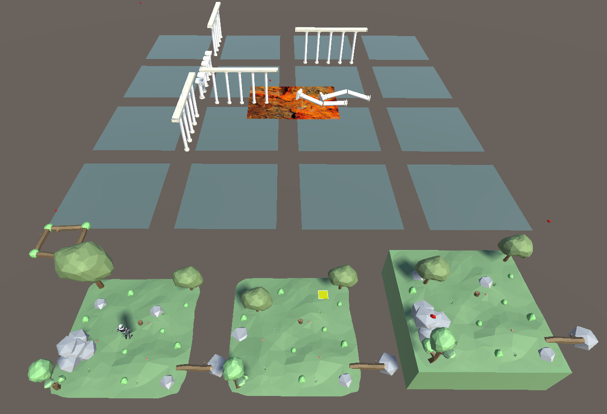

# Project Documentation

## Overview
This document provides a concise guide on how to use the project. It is meant to be used with a mobile device, using Vuforia. You need 3 players to play the game the intended way. One of them is the player, holding the phone. One of them is the helper, that will help the player by moving cards. One of them is the trapper, and moves a trap card.

The player controls a little robot that can walk on cards. The cards of the helper are platform on which the robot can walk. The player and the helper have to communicate so that the helper can place platform, and the player can move on them. The trapper has a trap card, which launch projectiles in front of him. He can not see the player, so he has to listen closely to the player and helper's communications so that he can try to guess where the player is, and make his life harder with his projectiles. 

### Project Details
- **Development Time** : Approximately 40 hours
- **Players required** : 2-3
- **Average playing time** : 10 minutes

### Setup Instructions:
1. **Vuforia Markers**: You'll need five Vuforia markers:
   - The first marker is an A4 format, positioned at the center. It is the center of our scene and our game will revolve around it. Here is the [file](https://drive.google.com/file/d/1FN74YKgntXEf8v9C3SqrSgmHMn3QvDcY/view?usp=sharing).
   - The remaining four markers represent the Drone, Fissure, Oxygen and Astronaut samples from Vuforia. The Oxygen is the trap card and the other ones are the platforms.

2. **UI and Landscape Mode**:
   - The UI is made for landscape mode.
   - The application may take a few seconds to start; don't worry if the screen appears black initially.

3. **Mobile UI**:
   - A joystick on the left to move
   - An A button to jump on the right

## Images

